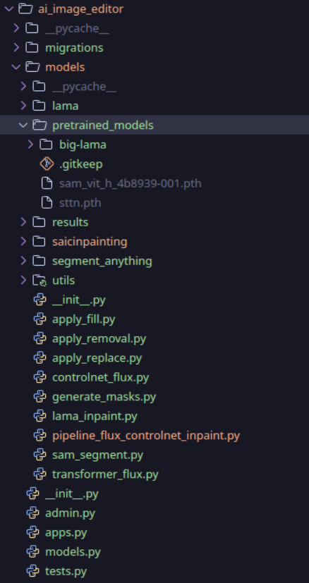
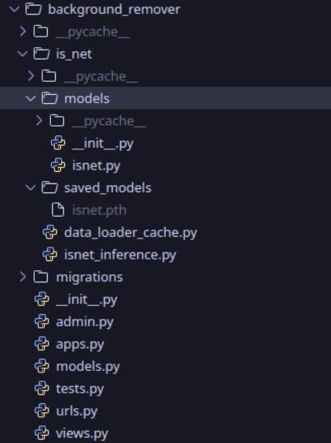

# DeepFX Studio

>Note:
This text is not AI-generated—I have personally written it. Please take the time to read it carefully.


## File Structures

```bash
./
├── ai_colorization
├── ai_eraser
├── ai_filter
├── ai_image_editor
├── ai_image_upscale
├── ai_text_to_image_generator
├── artistic_image_creator
├── background_remover
├── components
├── CONTRIBUTING.md
├── dashboard
├── db.sqlite3
├── deepfx_studio
├── docker-compose.yml
├── Dockerfile
├── INSTALLATION.md
├── manage.py
├── package.json
├── package-lock.json
├── pyproject.toml
├── README.md
├── requirements.txt
├── static
├── tailwind.config.js
├── templates
├── user_auth
└── website
```


These are seperate apps

```bash
├── templates # Contains all the HTML page for all this app in a single folder
├── deepfx_studio # This is the main App which controls all other apps in this django project
├── user_auth # Contains UI related compoents related to Django all-auth
├── ai_colorization # Contains Code Releated to AI Eraser Page(DeOldify)
├── ai_filter # Contains Code Releated to AI Filter Page (image_to_cartoon)
├── ai_image_editor # Contains Code Releated to AI Image Editor (Inpaint-Anything)
├── ai_image_upscale # Contains Code related to Image Upscale Page (Real-ESRGAN)
├── ai_text_to_image_generator # Contains Code related to Text to Image Generator Page
├── artistic_image_creator # Contains Code related to Artistix Image Create (NST)
├── background_remover # Contains Code Related to Backgroud Remover Page (Is-NET)
├── dashboard # Dashboard Page Related
└── website # Contains all the pages related to the website i.e landing page, Abiout Page or etc
```

Each Djnago App has a seperate folder named according to the model which they use

These are the pictures which will tell you where to place the models after you download them from [releases](https://github.com/XBastille/DeepFX-Studio/releases) page in github


#### AI Colorization


#### AI Filter


#### AI Image Editor



#### AI Image Upscale


#### Artistic Image Creator


#### Background Remover


