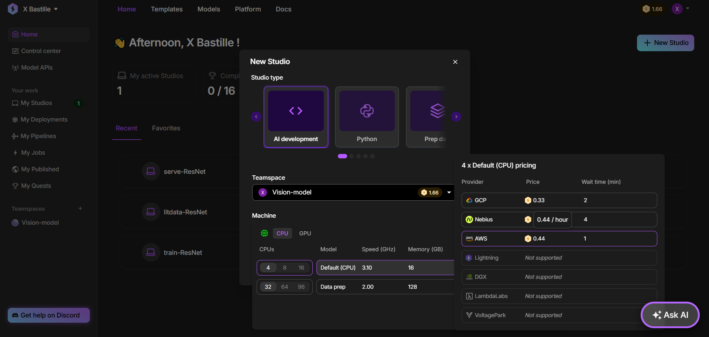
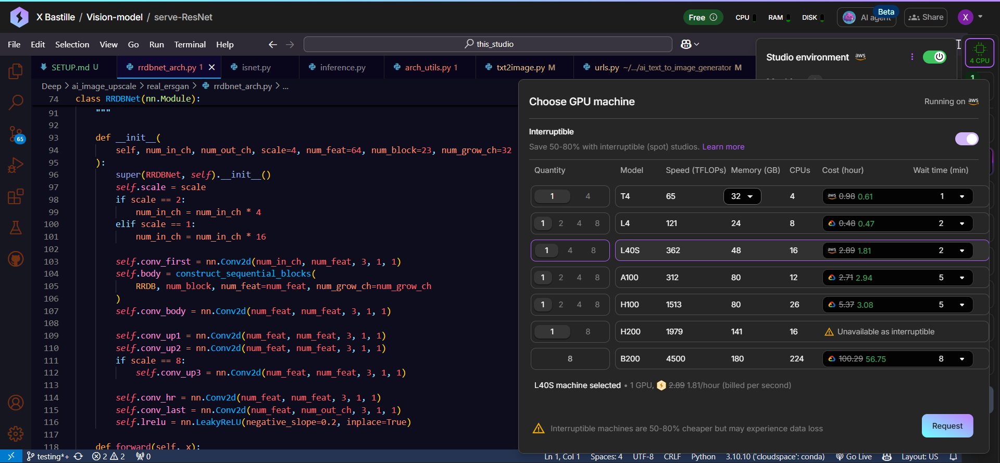
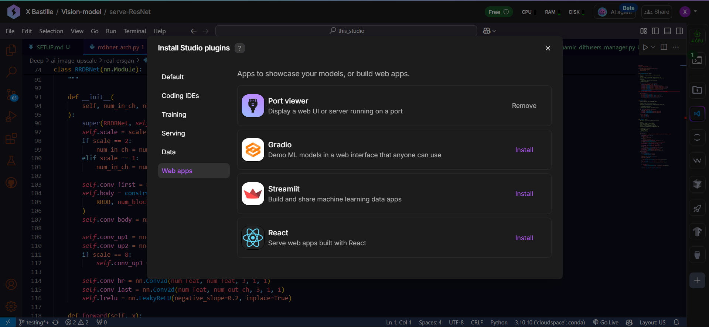
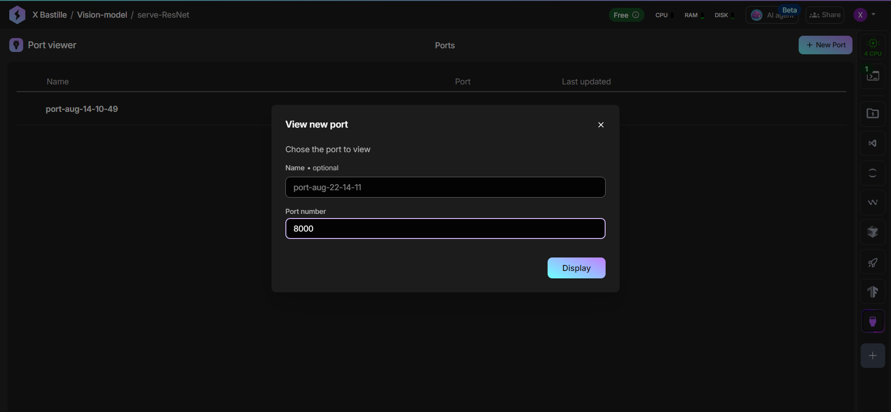

# DeepFX-Studio Installation Guide

## Important Notes

⚠️ **GPU Features**: NVIDIA Docker support is not ready yet. Docker setup only supports CPU-based features. For GPU-based features (Text-to-Image, Advanced Inpainting, Arcane Filter, Image Upscaling), manual setup is recommended.

⚠️ **Version Compatibility Issue**: There's a known dependency conflict where inpainting requires diffusers 0.30.2 while text-to-image requires diffusers 0.34.0. This hasn't been resolved in Docker yet. For full functionality, manual setup is recommended where you can switch between versions as needed.

## Docker Setup (CPU Features Only)

⚠️ **Note**: This setup only provides CPU-based features. GPU-intensive features will not work.

1. **Configure API Keys**

    Edit the `.env` file and add your API keys:

    ```bash
    # Django Configuration
    SECRET_KEY=your-secret-key-here
    DEBUG=TRUE

    # OAuth Configuration (Optional - for social login)
    GOOGLE_CLIENT_ID=your-google-client-id
    GOOGLE_CLIENT_SECRET=your-google-client-secret
    GITHUB_CLIENT_ID=your-github-client-id
    GITHUB_CLIENT_SECRET=your-github-client-secret

    # Security Settings (Production)
    SECURE_SSL_REDIRECT=false
    DJANGO_LOG_LEVEL=INFO

    # Server Configuration (Optional)
    WEB_CONCURRENCY=4
    TIMEOUT=30
    WORKER_CLASS=sync
    ```

2. **Build and Run with Docker**:

    ```bash
    # Build the container
    docker build -t deepfx-studio .
    
    # Run the container
    docker run -p 8000:8000 --env-file .env deepfx-studio
    ```

    > **Note**: The Dockerfile automatically downloads and places all required models in the correct locations.

🎉 **Ready to go!** Visit `http://localhost:8000` to start using DeepFX Studio!

## Manual Setup (Recommended for Full GPU Support)

### Prerequisites

- Python 3.10+
- Node.js 18+
- **High VRAM GPU**: Minimum 42GB VRAM required for Text-to-Image and Advanced Inpainting features (Recommended: 50GB+ VRAM)
  - For AWS: L40S (48GB VRAM) - Most cost-effective
  - For GCP: A100 (80GB VRAM) or H100 (80GB VRAM)
- Git

### Step-by-Step Installation

1. **Clone the Repository**

    ```bash
    git clone https://github.com/XBastille/DeepFX-Studio.git
    cd DeepFX-Studio
    ```

2. **Download Models**

    Download all necessary models from the [Releases page](https://github.com/XBastille/DeepFX-Studio/releases).
    
    📋 **Model Placement**: Refer to [SETUP.md](SETUP.md) for detailed instructions on where to place each model file.

    *Set Up HuggingFace CLI* (Required for Stable Diffusion 3.5 and Flux Inpaint)

    ```bash
    huggingface-cli login
    ```
    
    Then approve the use of `stabilityai/stable-diffusion-3.5-large` and `alimama-creative/flux.1-dev-controlnet-inpainting-beta` models on the HuggingFace website.

3. **Create Virtual Environment**

    ```bash
    python -m venv venv
    ```

4. **Activate Virtual Environment**

    **macOS/Linux:**
    ```bash
    source venv/bin/activate
    ```

    **Windows (CMD):**
    ```cmd
    venv\Scripts\activate
    ```

    **Windows (PowerShell):**
    ```powershell
    venv\Scripts\Activate.ps1
    ```

5. **Set Up Environment Variables**

    **macOS/Linux:**
    ```bash
    cp .env.example .env
    ```

    **Windows (CMD):**
    ```cmd
    copy .env.example .env
    ```

    **Windows (PowerShell):**
    ```powershell
    Copy-Item .env.example -Destination .env
    ```

    > **Important**: Set `DEBUG=TRUE` for local development or when running on Lightning.ai

7. **Install Python Dependencies**

    ```bash
    pip install -r requirements.txt
    ```

    > **For Dependency Conflicts**: If you encounter issues with diffusers version conflicts:
    > - For inpainting features: `pip install diffusers==0.30.2`
    > - For text-to-image features: `pip install diffusers==0.34.0`
    > - Switch between versions as needed for different features

8. **Install Node.js Dependencies**

    ```bash
    npm install
    ```

### Development Setup

For development, you need to run two commands in separate terminals:

**Terminal 1 - Django Server:**
```bash
python manage.py runserver
```

**Terminal 2 - TailwindCSS Watcher:**
```bash
npm run watch:css
```

🎉 **Ready to go!** Visit `http://localhost:8000` to start using DeepFX Studio!

### Production Setup

For production deployment:

```bash
# Collect static files
python manage.py collectstatic --no-input

# Run migrations
python manage.py migrate

# Start with gunicorn (production)
gunicorn deepfx_studio.wsgi:application --bind 0.0.0.0:8000
```

## GPU Setup for Lightning.ai

When running on Lightning.ai or other cloud GPU platforms:

1. Ensure `DEBUG=TRUE` is set in your environment
2. Install CUDA-compatible PyTorch version:
   ```bash
   pip install torch torchvision torchaudio --index-url https://download.pytorch.org/whl/cu118
   ```
3. Verify GPU availability:
   ```python
   import torch
   print(torch.cuda.is_available())
   ```

## Recommended: Lightning.ai Setup Guide

For users who want to run all GPU features without local GPU hardware, Lightning.ai provides an excellent cloud solution with high-VRAM GPUs.

### Lightning.ai Studio Setup

1. **Create Lightning.ai Account**
   - Go to [lightning.ai](https://lightning.ai) and sign up
   - You get 80 free GPU hours monthly + 15 free credits

2. **Create New Studio**
   - Navigate to your teamspace (free tier available)
   - Click "New Studio"
   - **Recommended Configuration**:
     - **AWS**: Select AWS CPU (*offers L40S GPU (48GB VRAM) - Most cost-effective option*)
     - **GCP**: Select GCP CPU (*offers A100 (80GB VRAM) or H100 (80GB VRAM) - Higher performance but more expensive*)
   
   

3. **Launch Studio**
   - Click "Start" to launch your studio
   - Wait for the VS Code environment to load (2-3 minutes)

4. **Setup Project**
   - Clone the repository in the terminal:
     ```bash
     git clone https://github.com/XBastille/DeepFX-Studio.git
     cd DeepFX-Studio
     ```
   - Follow all the manual installation steps above (steps 2-9)
   - Run database migrations:
     ```bash
     python manage.py migrate
     ```

5. **Switch to GPU**
   - **Important**: After completing all installations, switch from CPU to GPU
   - In the top-right corner of VS Code, click the machine type dropdown
   - Select your desired GPU (L40S 48GB recommended for cost-effectiveness)
   - **Enable "Interruptible"**: ✅ Recommended for cost savings
     - *What it is*: Interruptible instances can be stopped by the cloud provider when they need resources, but they offer significant cost discounts (up to 50%-70% off)
     - *Downside*: Your session might be interrupted during peak demand, requiring restart
     - *Reality*: Interruptions are rare and provide substantial cost savings for development work
   - **Any GPU with 48GB+ VRAM will work**, but L40S offers the best price-to-performance ratio
   
   

6. **Install Port viewer Plugin and Configure Access**
   - Click the "+" button at the bottom-right corner of VS Code to access Lightning.ai studio plugins
   - head to "web apps"
   - install a "Port viewer" plugin
   
   
   
   - Click on the new "Port viewer" tab in the bottom panel, then "Add Port" and enter `8000`
   
   

7. **Start Development Server**
   ```bash
   python manage.py runserver 
   ```
   - **Access Your Application**: Click on the port 8000 link in the Ports panel
   - This will open your DeepFX Studio application in a new browser tab
   - All GPU-intensive features (Text-to-Image, Advanced Inpainting, Upscaling, Arcane Filter) will now work perfectly!

### Lightning.ai Benefits
- **No local GPU required**: Access high-end GPUs (L40S, A100, H100) without hardware investment
- **Free tier**: 80 GPU hours monthly + 15 credits for additional usage
- **Cost-effective**: L40S instances with interruptible mode offer excellent value
- **Pre-configured environment**: VS Code with GPU drivers and CUDA already set up
- **Scalable**: Easy switching between different GPU types as needed

> **Pro Tip**: Use interruptible instances for development and switch to non-interruptible only for critical production deployments or long training sessions.

## Troubleshooting

### Common Issues

1. **Model Loading Errors**: Ensure all models are downloaded and placed correctly as per [SETUP.md](SETUP.md)
2. **GPU Memory Issues**: Make sure that your GPU has high RAM and VRAM or please try again later 
3. **Diffusers Version Conflicts**: Switch between 0.30.2 and 0.34.0 as needed for different features
4. **HuggingFace Authentication**: Make sure you're logged in and have approved model access

### Support

If you encounter issues:
- Check our [GitHub Issues](https://github.com/XBastille/DeepFX-Studio/issues)
- Create a new issue with detailed error logs