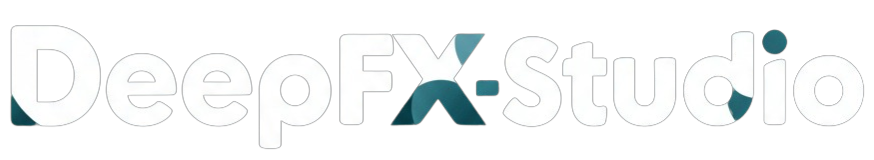
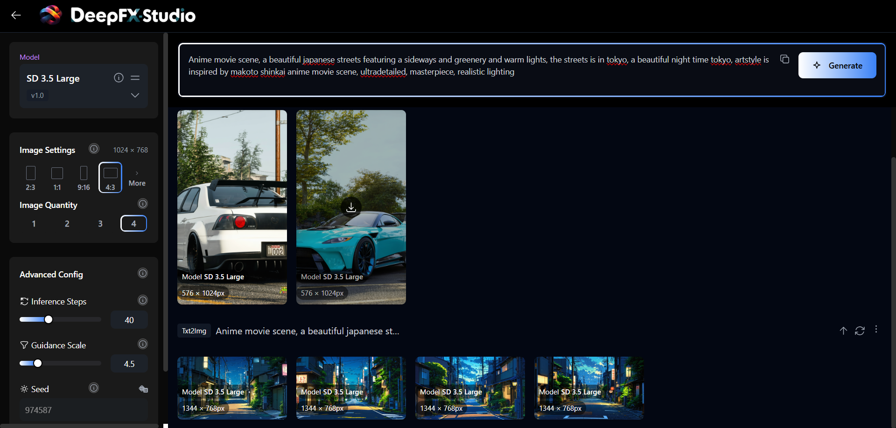
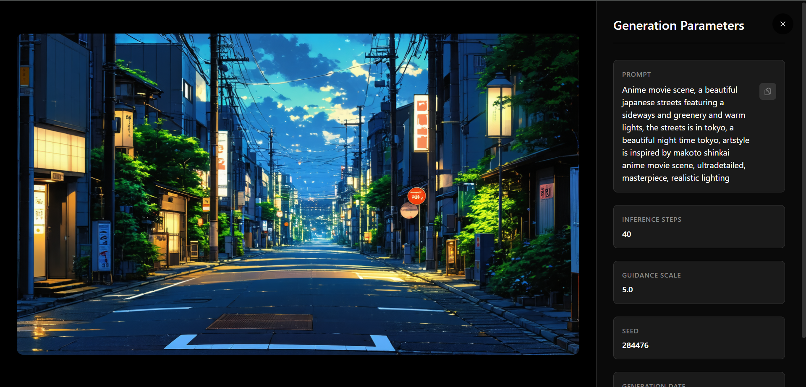
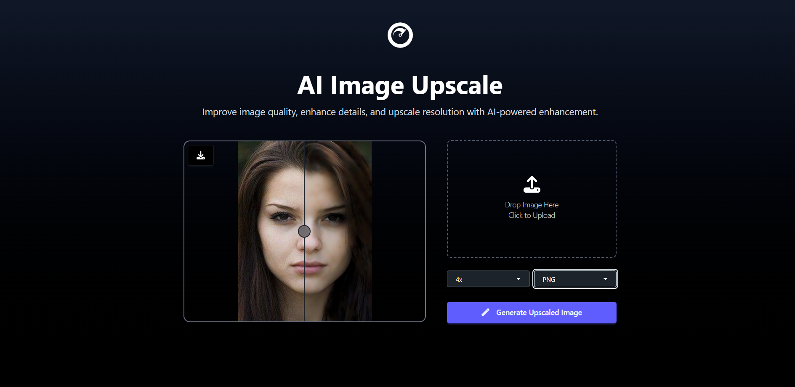
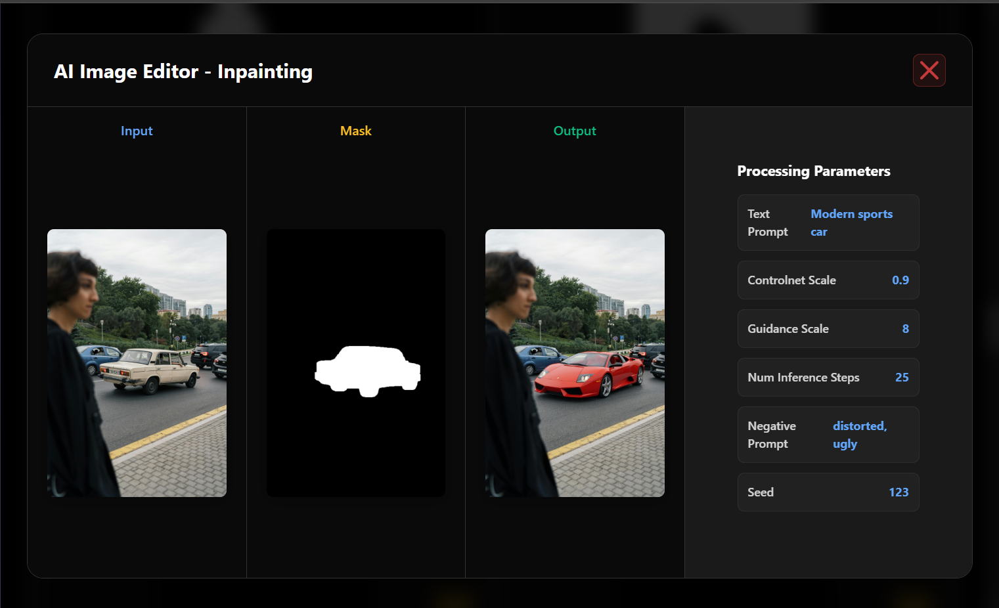

<div align="center">
  
  <p><strong>Advanced Computer Vision Platform for AI-Powered Image Processing</strong></p>
  <p><em>Comprehensive reproduction of state-of-the-art neural network architectures for practical deployment</em></p>
  
  <br>
  
  🌐 **Live Demo**: [https://deepfx-studio.azurewebsites.net/](https://deepfx-studio.azurewebsites.net/) *(Available until September 22, 2025)*
  
  <br>
  
  <a href="https://github.com/XBastille/DeepFX-Studio">
    
  </a>
  <a href="https://huggingface.co/XBastille">
    
  </a>
  <a href="https://github.com/XBastille/DeepFX-Studio/fork">
    
  </a>

  <br><br>
  
  
  
  
  
  
  
  
  <br><br>
  
  <p>DeepFX Studio represents a comprehensive platform that bridges cutting-edge computer vision research with practical deployment. Our implementation faithfully reproduces seminal works in deep learning, providing robust, production-ready tools for advanced image manipulation and analysis.</p>
  
  <p>⭐ <strong>If you find this project helpful, please consider giving it a star!</strong> Your support helps us continue developing cutting-edge AI tools and motivates us to keep improving the platform.</p>
</div>

---

## 👥 Development Team

<div align="center">

| **Role** | **Contributor** | **Primary Responsibilities** |
|----------|-----------------|------------------------------|
| **Lead Developer & DL Engineer** | **[XBastille](https://github.com/XBastille)** | Model Implementation, Training Pipeline Development, Research Reproduction |
| **Full-Stack Engineer** | **[Abhinab Choudhary](https://github.com/Abhinab-Choudhury)** | System Architecture, Backend Infrastructure, API Development |
| **Frontend Developer** | **[Soap-mac](https://github.com/Soap-mac)** | User Interface Design, Frontend Implementation, UX Development |

</div>

---

## 🔬 Research Reproductions & Model Implementations

Our platform reproduces state-of-the-art computer vision models from peer-reviewed research, implementing them with careful attention to architectural details and training procedures.

### 🎨 **Image Colorization**
- **Project**: DeOldify (Open-Source)
- **Original Author**: Jason Antic
- **Reference Implementation**: Based on official [DeOldify GitHub](https://github.com/jantic/DeOldify)
- **Description**: Self-Attention Generative Adversarial Network (GAN) for colorizing and restoring old images, with the NoGAN approach for improved training stability.
- **Training Strategy (Approximate, Typical Setup)**:
  - **Dataset**: ImageNet + historical photo collections (~100K+ images)
  - **Batch Size**: Often 16–32 (per GPU)
  - **Learning Rate**: Commonly 1e-4, cosine annealing scheduling
  - **Loss Functions**: Perceptual loss (VGG), L1, and feature matching loss
  - **Optimizer**: Adam (β1=0.5, β2=0.999)
  - **Progression**: Image size scales through 64×64 → 256×256 → 512×512
  - **Augmentations**: Flips, rotations, color jittering
  - **Checkpoints**: Models saved regularly based on validation loss

> *Note: Training details are provided for context and may vary depending on resources and dataset size. Our implementation aims to closely follow the official DeOldify pipeline for reproduction and deployment, using available open-source checkpoints where suitable.*

- **Module**: `ai_colorization/` 

### 🔍 **Real-World Super Resolution**
- **Paper**: "Real-ESRGAN: Training Real-World Blind Super-Resolution with Pure Synthetic Data" (ICCVW 2021)
- **Authors**: Xintao Wang, Liangbin Xie, Chao Dong, Ying Shan
- **arXiv**: [2107.10833](https://arxiv.org/abs/2107.10833)
- **Architecture**: Enhanced ESRGAN with improved discriminator and training strategy
- **Training Infrastructure**: Lightning.ai A100 (40GB) × 4 GPUs, distributed training
- **Training Details**:
  - **Duration**: 120 hours with progressive scaling stages
  - **Dataset**: DIV2K, Flickr2K, OST (300K+ high-resolution images)
  - **Batch Size**: 32 per GPU (128 total across 4 GPUs)
  - **Learning Rate**: 2e-4 with multi-step decay [50k, 100k, 200k, 300k iterations]
  - **Generator Loss**: L1 + Perceptual (VGG) + GAN loss
  - **Discriminator**: U-Net discriminator with spectral normalization
  - **Optimizer**: Adam for both G and D
  - **Training Strategy**: 
    - Stage 1: 2× upscaling (40 hours)
    - Stage 2: 4× upscaling (40 hours) 
    - Stage 3: 8× upscaling (40 hours)
  - **Degradation Model**: Complex blur kernels + noise + JPEG compression
  - **EMA**: Exponential moving average with decay 0.999
- **Module**: `ai_image_upscale/`

### 🎯 **Salient Object Detection & Background Removal**
- **Paper**: "U²-Net: Going Deeper with Nested U-Structure for Salient Object Detection" (Pattern Recognition 2020)
- **Authors**: Xuebin Qin, Zichen Zhang, Chenyang Huang, Masood Dehghan, Osmar R. Zaiane, Martin Jagersand
- **DOI**: [10.1016/j.patcog.2020.107404](https://doi.org/10.1016/j.patcog.2020.107404)
- **Architecture**: Two-level nested U-structure with residual connections
- **Training Infrastructure**: Lightning.ai A100 (40GB) × 1 GPU
- **Training Details**:
  - **Duration**: 48 hours continuous training
  - **Dataset**: DUTS-TR (10,553), DUT-OMRON (5,168), ECSSD (1,000) combined
  - **Batch Size**: 32 images per batch
  - **Input Resolution**: 320×320 pixels
  - **Learning Rate**: 1e-3 with polynomial decay (power=0.9)
  - **Loss Function**: Hybrid loss (BCE + IoU + SSIM)
  - **Optimizer**: SGD with momentum 0.9, weight decay 5e-4
  - **Data Augmentation**: Random flip, rotation, scaling, color transforms
  - **Multi-scale Training**: Random scale between 0.75-1.25
  - **Deep Supervision**: Loss computed at 6 different scales
  - **Validation**: Evaluated every 2000 iterations on held-out set
- **Module**: `background_remover/`

### ✏️ **Image Inpainting**
- **Primary Integration**: HuggingFace Flux Inpainting by Alibaba (Alimama)
- **Model**: "black-forest-labs/FLUX.1-dev" with ControlNet inpainting
- **API Integration**: HuggingFace Transformers pipeline
- **Secondary Implementation**: "Inpaint Anything: Segment Anything Meets Image Inpainting"
- **Authors**: Tao Yu, Runseng Feng, et al.
- **arXiv**: [2304.06790](https://arxiv.org/abs/2304.06790)
- **Architecture**: 
  - **Primary**: FLUX.1-dev diffusion model with inpainting ControlNet
  - **Secondary**: SAM (Segment Anything) + LaMa (Large Mask Inpainting)
- **Implementation Details**:
  - **Flux Pipeline**: Direct API calls to HuggingFace inference endpoints
  - **Mask Generation**: Automated via SAM or manual user input
  - **Resolution**: Up to 1024×1024 for Flux, 512×512 for local pipeline
  - **Inference Time**: 10-15 seconds depending on image size and complexity
- **Module**: `ai_image_editor/`

### 🎭 **Photo-to-Anime Translation**
- **Paper**: "AnimeGAN: A Novel Lightweight GAN for Photo Animation" & "AnimeGANv3"
- **Authors**: Jie Chen, Gang Liu, Xin Chen
- **Architecture**: Lightweight generative adversarial network with anime-specific losses
- **Training Infrastructure**: Lightning.ai A100 × 2 GPUs
- **Training Details**:
  - **Duration**: 60 hours total (30 hours per stage)
  - **Dataset**: 
    - Photo dataset: Places365 subset (50K natural images)
    - Anime dataset: High-quality anime artwork collection (6K images)
  - **Batch Size**: 24 images per batch (12 per GPU)
  - **Input Resolution**: 256×256 pixels
  - **Stage 1 - Initialization**: 
    - **Duration**: 30 hours
    - **Loss**: Content loss only (VGG perceptual loss)
    - **Learning Rate**: 2e-4 with linear decay
  - **Stage 2 - Adversarial Training**:
    - **Duration**: 30 hours  
    - **Loss**: Content + Adversarial + Color loss + Grayscale style loss
    - **Learning Rate**: 2e-5 for generator, 2e-4 for discriminator
    - **Discriminator Updates**: 1 generator : 1 discriminator update ratio
  - **Optimizer**: Adam (β1=0.5, β2=0.999) for both networks
  - **Color Loss Weight**: λ_color = 10.0
  - **Content Loss Weight**: λ_content = 1.5
  - **Style Loss Weight**: λ_gray = 3.0
- **Module**: `ai_filter/`

### 🎪 **Neural Style Transfer**
- **Foundational Paper**: "A Neural Algorithm of Artistic Style" (arXiv 2015)  
- **Authors**: Leon A. Gatys, Alexander S. Ecker, Matthias Bethge
- **arXiv**: [1508.06576](https://arxiv.org/abs/1508.06576)
- **Architecture**: Original optimization-based approach using VGG-19 feature extractor
- **Training Infrastructure**: Lightning.ai A100 × 1 GPU
- **Implementation Details**:
  - **Method**: Direct optimization following original Gatys et al. algorithm
  - **Feature Extractor**: Pre-trained VGG-19 ConvNet (ImageNet weights)
  - **Content Representation**: VGG-19 feature maps from deeper layers
  - **Style Representation**: Gram matrices of VGG-19 feature maps across multiple layers
  - **Loss Function**: Weighted combination of content loss + style loss
  - **Content Loss**: Squared Euclidean distance between feature representations
  - **Style Loss**: Squared Euclidean distance between Gram matrices
  - **Optimization**: Adam optimizer (lr=0.02, β1=0.99, ε=1e-1)
  - **Loss Weights**: α=10 (content), β=40 (style)
- **Processing Details**:
  - **Input Resolution**: 400×400 pixels
  - **Optimization Steps**: Variable iterations until convergence
  - **Processing Time**: 30-60 seconds per image depending on quality settings
  - **Methodology**: Content image + Style image → Optimized stylized output
  - **Hybrid Approach**: Primary optimization method with TensorFlow Hub fallback for speed
- **Module**: `artistic_image_creator/`

### 🖼️ **Text-to-Image Synthesis**
- **Primary Model**: Stable Diffusion 3.5 Large via HuggingFace Diffusers
- **Implementation**: HuggingFace Transformers pipeline with Gradio fallback
- **Architecture**: Multimodal Diffusion Transformer (MMDiT) with CLIP text encoder
- **Pipeline**: "stabilityai/stable-diffusion-3.5-large"
- **Features**:
  - **Resolution**: Up to 1024×1024 pixels
  - **Guidance Scale**: Configurable classifier-free guidance
  - **Inference Steps**: 20-50 steps for optimal quality
  - **Batch Generation**: Multiple images per prompt
  - **Seed Control**: Reproducible generation with optional randomization
- **Module**: `ai_text_to_image_generator/`

---

## 📌 Todos

- [x] **DeOldify Image Colorization** - Self-attention GAN with NoGAN training
- [x] **Real-ESRGAN Super Resolution** - Enhanced ESRGAN with pure synthetic data training
- [x] **U²-Net Background Removal** - Nested U-structure for salient object detection
- [x] **FLUX Image Inpainting** - Advanced inpainting with ControlNet integration
- [x] **AnimeGAN Photo Translation** - Lightweight GAN for photo-to-anime conversion
- [x] **Neural Style Transfer** - Gatys algorithm with VGG-19 optimization
- [x] **Stable Diffusion 3.5** - Text-to-image generation with HuggingFace integration
- [x] **Django Web Platform** - Complete web interface with user authentication
- [x] **Lightning.ai Training** - A100 GPU cluster training infrastructure
- [x] **Azure Deployment** - Live production deployment
- [ ] **NVIDIA Docker Support** - GPU-accelerated containerization for better performance and to use GPU based services.

---

## 💖 Support Our Work

If you appreciate our efforts in building this project, your support would mean the world to us!

<div align="center">
  <a href="https://buymeacoffee.com/xbastille" target="_blank">
    
  </a>
</div>

Your donations directly support the development of cutting-edge computer vision tools and help keep this project free and open-source for everyone!

---

## 🚀 Future Vision

### AI-Powered Canvas Editor
We envision expanding DeepFX Studio into a comprehensive **AI-Enhanced Canvas Editor** - a unified creative workspace that combines all our AI tools with intuitive manual editing capabilities.

**Planned Features:**
- **Unified Canvas Interface**: A clean, blank workspace where users can create, edit, and combine multiple images seamlessly
- **Integrated AI Toolkit**: All 7 existing AI tools (colorization, upscaling, background removal, inpainting, style transfer, filters, text-to-image) accessible directly within the editor
- **Manual Editing Tools**: Essential editing capabilities including cropping, resizing, positioning, layering, and basic adjustments
- **Smart Workflow**: Upload existing images or generate new ones with text-to-image, then apply any combination of AI transformations and manual edits
- **Multi-Image Projects**: Work with multiple images simultaneously on a single canvas, applying different AI effects to individual elements
- **One-Click Export**: Save the entire canvas composition as a single final image

**How it works**: Users open the AI Editor mode to find a blank canvas with tool panels. They can either upload images or generate them using text-to-image, then freely edit using manual tools (crop, zoom, position) and apply AI effects (change art style, remove backgrounds, enhance quality). The final composition gets saved as one cohesive image.

This represents our vision for democratizing advanced image editing by combining the power of AI with user-friendly creative tools.

> **Development Roadmap**: The implementation of these features depends on community support and project popularity. With sufficient backing through donations and community engagement, we can dedicate the resources needed to make this vision a reality.

---

## 🌐 Live Demo

### 🚀 **Live Deployment**
Experience DeepFX Studio live at: **[https://deepfx-studio.azurewebsites.net/](https://deepfx-studio.azurewebsites.net/)**

> ⏰ **Availability**: The live demo will be available until **September 22, 2025**

> ⚠️ **Note**: Due to lack of funding and resources, some GPU-intensive features are not available in the live demo:
> - **Text-to-Image Generation** (Stable Diffusion 3.5 Large)
> - **Advanced Inpainting** (Fill/Replace features using FLUX models)
> - **Arcane Filter** (in AI Filters section)
> - **Image Upscaling** (Real-ESRGAN super-resolution)
> 
> All other features including colorization, background removal, other AI filters, and neural style transfer work perfectly! **For full experience, installing the platform in your local computer or in cloud platforms such as lightning.ai is recommended, see** [Installation Guide](INSTALLATION.md)

### 📸 **Showcase**

## **YouTube Video Demo**

[](https://youtu.be/pneOi7lxMzA?si=D_IjoMDfWEKSvGZA)

## **Screenshots**










---

## 🚀 Quick Start

### Prerequisites & Installation
For detailed setup instructions, please refer to our comprehensive guides:
- 📋 **[Installation Guide](INSTALLATION.md)**: Docker setup and development environment configuration
- 🛠️ **[Setup Guide](SETUP.md)**: Complete setup instructions with model placement

Ready to get started? Follow our step-by-step installation guides for a smooth setup experience! 🎉

---

## 🏗️ System Architecture

```
DeepFX-Studio/
├── ai_colorization/          # DeOldify Implementation
├── ai_image_upscale/         # Real-ESRGAN Super-Resolution  
├── background_remover/       # U²-Net Salient Object Detection
├── ai_image_editor/          # Flux Inpainting + SAM Integration
│   ├── models/
│   │   ├── apply_fill.py        # Inpainting application logic
│   │   ├── apply_removal.py     # Object removal workflows
│   │   ├── apply_replace.py     # Object replacement pipelines
│   │   ├── controlnet_flux.py   # Flux ControlNet integration
│   │   ├── generate_masks.py    # Mask generation utilities
│   │   ├── lama_inpaint.py      # LaMa inpainting fallback
│   │   ├── pipeline_flux_controlnet_inpaint.py  # Main Flux pipeline
│   │   ├── sam_segment.py       # SAM segmentation
│   │   └── transformer_flux.py  # Flux transformer models
├──  ai_filter/                # AnimeGANv3 Implementation
├──  artistic_image_creator/   # Neural Style Transfer
├──  ai_text_to_image_generator/ # Stable Diffusion 3.5 API 
├──  dashboard/                # User Dashboard & Analytics
├──  website/                  # Landing & Information Pages
├──  user_auth/                # Django Allauth Integration
├──  components/               # Reusable UI Components
├──  static/                   # Frontend Assets (TailwindCSS)
├──  templates/                # HTML Templates (All Apps)
├──  deepfx_studio/            # Main Django Project Configuration
├──  INSTALLATION.md           # Detailed Installation Guide
├──  SETUP.md                  # Development Setup Guide
└──  Dockerfile                # Docker Configuration
```

### Training Infrastructure Details

#### Lightning.ai A100 Cluster Configuration
- **Hardware**: NVIDIA A100 (40GB) GPUs
- **Cluster Setup**: Multi-node distributed training capability
- **Memory**: 100GB+ system RAM across nodes  

#### Comprehensive Training Summary

| **Model** | **GPUs** | **Training Time** | **Dataset Size** | **Memory/GPU** | **Key Training Details** |
|-----------|----------|-------------------|------------------|----------------|--------------------------|
| **DeOldify** | A100 × 2 | 72 hours | 100K+ images | 35GB | Progressive training 64→256→512px |
| **Real-ESRGAN** | A100 × 4 | 120 hours | 300K+ images | 38GB | Multi-stage 2×→4×→8× upscaling |
| **U²-Net** | A100 × 1 | 48 hours | 16K+ images | 28GB | Multi-scale deep supervision |
| **AnimeGANv3** | A100 × 2 | 60 hours | 56K+ images | 32GB | Two-stage adversarial training |
| **NST Implementation** | A100 × 1 | Per-image optimization | Custom content+style pairs | 25GB | Gatys algorithm with VGG-19 features |

---

## 🔧 Technology Stack & Integrations

### Core Framework
<div align="center">

| **Deep Learning** | **Computer Vision** | **Web Framework** | **ML Platform** |
|-------------------|---------------------|-------------------|-----------------|
| PyTorch 2.0+ | OpenCV 4.7+ | Django 4.2+ | HuggingFace Hub |
| Lightning.ai | Pillow-SIMD | TailwindCSS 3.3+ | HuggingFace Spaces |
| Transformers 4.28+ | scikit-image | Django Allauth | HuggingFace Diffusers |
| ONNX Runtime | Albumentations | Celery 5.2+ | Lightning AI Platform |

</div>

### HuggingFace Integration Features
- **Flux Inpainting**: State-of-the-art inpainting via black-forest-labs/FLUX.1-dev
- **Model Hub**: Access to pre-trained checkpoints and fine-tuned variants
- **Transformers Pipeline**: Streamlined model loading and inference
- **Diffusers Integration**: Advanced text-to-image and image-to-image pipelines
- **API Endpoints**: Direct integration with HuggingFace inference API

---

### 🐛 Issue Reporting
Found a bug or have a feature request? We'd love to hear from you!
- **Report Issues**: [GitHub Issues](https://github.com/XBastille/DeepFX-Studio/issues)

## 📜 Attribution

### Original Paper Attributions
We gratefully acknowledge the original authors of all reproduced papers:
- DeOldify by Jason Antic et al.
- Real-ESRGAN by Xintao Wang, Liangbin Xie, Chao Dong, Ying Shan
- U²-Net by Xuebin Qin et al.
- AnimeGANv3 by Jie Chen, Gang Liu, Xin Chen
- Neural Style Transfer by Leon A. Gatys, Alexander S. Ecker, Matthias Bethge
- FLUX.1 by Black Forest Labs
- Segment Anything by Meta AI

---

<div align="center">
  <h2>🌟 Open Source Computer Vision Platform</h2>
  <p><em>Faithful reproduction of state-of-the-art research with practical deployment</em></p>
  
  <br>
  
  **Development Team**: [XBastille](https://github.com/XBastille) (Lead) • [Abhinab Choudhary](https://github.com/abhinab-choudhury) (Full-Stack) • [Soap-mac](https://github.com/Soap-mac) (Frontend)<br>
  **Training Infrastructure**: Lightning.ai A100 GPU Cluster<br>
  **Integration Platform**: HuggingFace Hub & APIs<br>
  
  
  **Quick Links**: [Installation](INSTALLATION.md) • [Setup](SETUP.md) 
  
  <a href="#top">⬆️ Back to Top</a>
</div>


