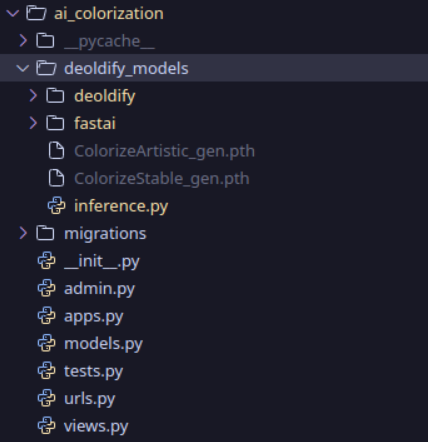
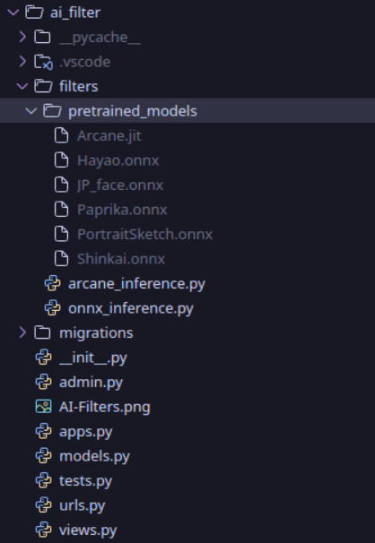
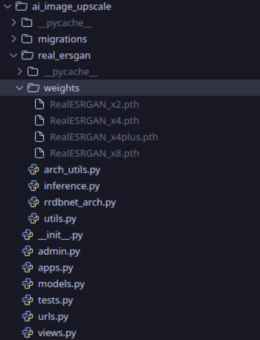
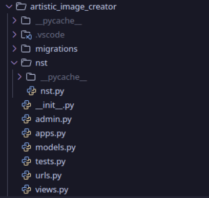

# DeepFX Studio

>Note:
This text is not AI-generated—I have personally written it. Please take the time to read it carefully.


## File Structures

```bash
./
├── ai_colorization
├── ai_filter
├── ai_image_editor
├── ai_image_upscale
├── ai_text_to_image_generator
├── artistic_image_creator
├── background_remover
├── components
├── SETUP.md
├── dashboard
├── db.sqlite3
├── deepfx_studio
├── docker-compose.yml
├── Dockerfile
├── Dockerfile.gpu
├── build-gpu.bat
├── build-gpu.sh
├── download-models.bat          
├── download-models.sh           
├── INSTALLATION.md
├── manage.py
├── package.json
├── package-lock.json
├── pyproject.toml
├── README.md
├── requirements.txt
├── static
├── tailwind.config.js
├── templates
├── user_auth
└── website
```


These are seperate apps

```bash
├── templates # Contains all the HTML page for all this app in a single folder
├── deepfx_studio # This is the main App which controls all other apps in this django project
├── user_auth # Contains UI related compoents related to Django all-auth
├── ai_colorization # Contains Code Releated to AI Colorization Page (DeOldify)
├── ai_filter # Contains Code Releated to AI Filter Page (AnimeGAN/Image-to-Cartoon)
├── ai_image_editor # Contains Code Releated to AI Image Editor (FLUX Inpainting + SAM)
├── ai_image_upscale # Contains Code related to Image Upscale Page (Real-ESRGAN)
├── ai_text_to_image_generator # Contains Code related to Text to Image Generator Page (Stable Diffusion 3.5)
├── artistic_image_creator # Contains Code related to Artistic Image Creator (Neural Style Transfer)
├── background_remover # Contains Code Related to Background Remover Page (U²-Net)
├── dashboard # Dashboard Page Related
└── website # Contains all the pages related to the website i.e landing page, About Page or etc
```

## Model Download Scripts

For easy model setup, we provide automated download scripts:

- **Windows Users**: 
  ```cmd
  download-models.bat
  ```
- **Linux/macOS Users**: 
  ```bash
  ./download-models.sh
  ```

These scripts automatically download all required models from our GitHub releases and Google Drive, placing them in the correct directory structure.

## GPU build scripts (exact commands)

Run the included GPU build helpers to build the GPU Docker image. The scripts use the `HF_TOKEN` / `hf_token` environment variable to optionally pre-download gated HuggingFace models. Examples (copy-paste):

- Windows (PowerShell):

```powershell
$env:HF_TOKEN = 'hf_token'
.\build-gpu.bat
```

- Windows (CMD):

```cmd
set HF_TOKEN=hf_token
build-gpu.bat
```

- Linux / macOS (bash):

```bash
export HF_TOKEN=hf_token
chmod +x build-gpu.sh
./build-gpu.sh
```

## Model Placement Guide

## Model Placement Guide

Each Django App has a separate folder named according to the model which they use.

If you prefer manual model placement, these are the pictures which will tell you where to place the models after you download them from [releases](https://github.com/XBastille/DeepFX-Studio/releases) page in GitHub:


#### AI Colorization



#### AI Filter



#### AI Image Editor


#### AI Image Upscale



#### Artistic Image Creator



#### Background Remover


#### Text To Image


